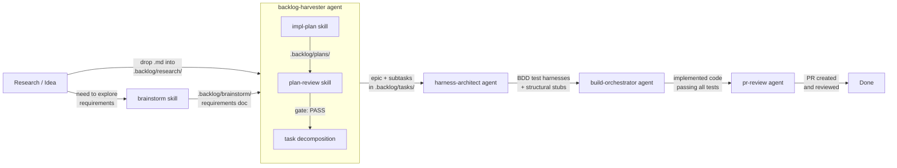

# Agent Instructions

This file is read automatically by `copilot` CLI and other agent tools that
support `AGENTS.md`. It defines the authoritative rules for working in this
repository. All agents operating here must follow these instructions regardless
of flags such as `--allow-all`, `--yolo`, or `--autopilot`.

Last updated: 2026-03-29 | Constitution version: 2.2.0

---

## Core Principles

### I. Safety-First Rust (NON-NEGOTIABLE)

All production code MUST be written in Rust (stable toolchain, edition 2024,
`rust-version = "1.85"`). `unsafe` code is forbidden at the workspace level
(`#![forbid(unsafe_code)]`). Clippy pedantic lints MUST pass with zero warnings.
`unwrap()` and `expect()` are denied; all fallible operations MUST use the
`Result`/`EngramError` pattern defined in `src/errors/mod.rs`.

### II. MCP Protocol Fidelity

The server MUST implement the Model Context Protocol via the `mcp-sdk` 0.0.3
crate (JSON-RPC 2.0). All MCP tools MUST be unconditionally visible to every
connected agent regardless of configuration. Tools called in inapplicable
contexts (e.g., workspace-scoped tools before `set_workspace`) MUST return a
descriptive error rather than being hidden. Transport is SSE (GET `/sse`) with
JSON-RPC dispatch (POST `/mcp`).

### III. Test-First Development (NON-NEGOTIABLE)

Every feature MUST have tests written before implementation code. The test
directory structure (`tests/contract/`, `tests/integration/`, `tests/unit/`)
MUST be maintained. All tests MUST pass via `cargo test` before any code is
merged. Steps: write test → confirm it fails (red) → implement → confirm it
passes (green). Never write production code before the corresponding test
exists and has been observed to fail.

### IV. Workspace Isolation and Security Boundaries

All file-system operations MUST resolve within the configured workspace root.
Path traversal attempts MUST be rejected. Each workspace MUST map to a unique
SurrealDB database via deterministic SHA-256 hash of the canonical workspace
path. Database queries MUST execute solely within the active workspace's
database context. The daemon MUST bind exclusively to `127.0.0.1`; no external
network exposure is permitted.

### V. Structured Observability

All significant operations MUST emit structured tracing spans to stderr via
`tracing-subscriber`. Span coverage MUST include: MCP tool call execution,
workspace lifecycle events (bind, hydrate, flush), database operations, SSE
connection management, and embedding/search operations.

### VI. Single-Binary Simplicity

The project MUST produce a single binary (`engram`). New dependencies MUST be
justified by a concrete requirement — do not add libraries speculatively.
Prefer the standard library over external crates when adequate. SurrealDB
embedded (surrealkv) is the sole persistence layer; do not introduce additional
databases or caches. Optional capabilities (e.g., embeddings via `fastembed`)
MUST use Cargo feature flags.

### VII. CLI Workspace Containment (NON-NEGOTIABLE)

When an agent operates in CLI mode, it MUST NOT create, modify, or delete any
file or directory outside the current working directory tree. This applies to
all file operations. Paths that resolve above or outside the cwd — whether via
absolute paths, `..` traversal, symlinks, or environment variable expansion —
MUST be refused. The only exception is reading files explicitly provided by
the user as context.

### VIII. Destructive Terminal Command Approval (NON-NEGOTIABLE)

All destructive terminal commands MUST go through agent-intercom operator
approval before execution, regardless of `--allow-all`, `--yolo`, or any
other permissive mode. A terminal command is destructive if it:

- Deletes files or directories (`rm`, `Remove-Item`, `del`, `rmdir`)
- Overwrites files without backup (`mv` to existing target, `Move-Item -Force`)
- Modifies system configuration (`reg`, `Set-ExecutionPolicy`, `chmod`, `chown`)
- Alters version control history (`git reset --hard`, `git push --force`, `git clean -fd`)
- Drops or truncates database content (`DROP TABLE`, `TRUNCATE`, `DELETE FROM` without `WHERE`)
- Installs or removes system-level packages (`npm install -g`, `cargo install`, `apt remove`)
- Executes arbitrary code from untrusted sources (`curl | sh`, `iex (irm ...)`)

Required workflow: `auto_check` → `check_clearance` → execute only after
`status: "approved"`. Permissive flags do NOT bypass this gate.

### IX. Engram-First Search (NON-NEGOTIABLE)

All context-related searches MUST use the `engram` MCP server tools before
falling back to file-based search (grep, glob, file reading). The engram
daemon maintains an indexed code graph, semantic search index, and workspace
memory that return precise, pre-indexed results with minimal token cost.
File-based search tools (grep, glob, view) read raw file content into the
context window, consuming tokens proportional to file size.

**Required search preference order:**

1. **Engram tools first**: `unified_search`, `query_memory`, `map_code`,
   `list_symbols`, `impact_analysis`, `query_graph`
2. **File-based fallback**: grep, glob, view — only when engram results are
   insufficient, unavailable, or the query targets literal text patterns
   that the code graph does not index

**Tool-to-question mapping** — use the most specific tool first:

| Question | Correct engram tool | Forbidden alternative |
|---|---|---|
| Does method `foo` exist in `src/db/queries.rs`? | `list_symbols(file_path="src/db/queries.rs", name_contains="foo")` | `grep -n "fn foo" src/db/queries.rs` |
| What calls `workspace_hash`? | `map_code("workspace_hash", depth=1)` | `grep -rn "workspace_hash" src/` |
| What would break if I change `connect_db`? | `impact_analysis("connect_db")` | Reading every caller file |
| What symbols are defined in `src/services/file_tracker.rs`? | `list_symbols(file_path="src/services/file_tracker.rs")` | `view src/services/file_tracker.rs` |
| Find all structs/fns related to "branch" concept | `list_symbols(name_contains="branch")` | Multiple grep passes |
| Broad discovery — code + context + commits | `unified_search(query="...")` | N/A (no file equivalent) |
| What does `DaemonState` contain? | `list_symbols(name_contains="DaemonState")` | `grep -A20 "struct DaemonState"` |

**When `unified_search` returns error 5001** ("failed to deserialize; expected a
32-bit floating point, found NaNf64"), embedding vectors in the DB are corrupted.
Do not retry. Fall back immediately to `list_symbols` + `map_code` + `impact_analysis`
for the same discovery work — these three tools cover the entire blast-radius analysis
workflow without relying on the embedding index.

**Daemon IPC patterns** (when interacting with the running engram daemon via IPC):

- The daemon auto-binds its own workspace at startup via `--workspace`. Do NOT
  call `set_workspace` via IPC — it returns error 1005 "Workspace limit reached".
  Use `get_workspace_status` to verify the binding instead.
- Windows named pipe address: `\\.\pipe\engram-{first_16_hex_of_SHA256(canonical_path)}`
  where `canonical_path` is the fully resolved absolute workspace path.

**When file-based search is appropriate:**

- Exact regex pattern matching across file *text* (engram indexes symbols, not
  arbitrary string patterns)
- Finding files by name or extension (glob) when the path is not already known
- Reading a file whose exact path is already known and the content — not structure —
  is needed (e.g., checking a specific line after engram identified the line number)
- The engram workspace is not yet bound or indexed

**Rationale**: A single `unified_search` call returns ranked, relevant
results from code symbols, context records, and commit history in one
response. The equivalent grep-based approach requires multiple calls,
each injecting raw file content into the context window, leading to
rapid context growth and degraded agent reasoning quality.

This project uses **Backlog.md** for issue tracking. Tasks live in `.backlog/tasks/`.

## Quick Reference

```bash
# Via Backlog.md MCP tools
backlog-task_list --status "To Do"   # Find available work
backlog-task_view --id <id>          # View task details
backlog-task_edit --id <id> --status "In Progress"  # Claim work
backlog-task_complete --id <id>      # Complete work
```

---

## Technical Constraints

| Concern | Constraint |
|---|---|
| Language | Rust stable, edition 2024, `rust-version = "1.85"` |
| Async runtime | Tokio 1 (full features) |
| MCP SDK | `mcp-sdk` 0.0.3 — JSON-RPC 2.0 over SSE |
| HTTP transport | Axum 0.7 — SSE at `/sse`, JSON-RPC at `/mcp` |
| Persistence | SurrealDB 2 embedded (surrealkv), per-workspace namespace via SHA-256 |
| Serialization | serde 1, serde_json 1, `#[serde(rename_all = "snake_case")]` on enums |
| CLI | clap 4 (derive + env), env prefix `ENGRAM_` |
| Tracing | tracing 0.1, tracing-subscriber 0.3 |
| Embeddings | `fastembed` 3 (optional, behind `embeddings` feature flag) |
| Diff/Merge | `similar` 2 for structured diff merge during dehydration |
| Testing | proptest 1, tokio-test 0.4; TDD required |
| Formatting | `cargo fmt --all -- --check` |
| Linting | `cargo clippy` pedantic deny, `unwrap_used` deny, `expect_used` deny |
| Build check | `cargo test && cargo clippy` MUST pass before merge |

---

## Quality Gates

Run in order. Do not skip any gate.

```powershell
# Gate 1 — Compilation
cargo check
# Gate 2 — Lint (zero warnings required)
cargo clippy -- -D warnings
# Gate 3 — Formatting
cargo fmt --all -- --check
# If violations: cargo fmt --all
# Gate 4 — Tests (all must pass)
cargo test
# If output truncated:
cargo test 2>&1 | Out-File logs\test-results.txt
```

---

## Code Style and Conventions

### Error Handling

- All fallible operations return `Result<T, EngramError>`
- `EngramError` wraps domain-specific sub-errors via `#[from]`; each variant maps to a u16 error code
- Error codes: 1xxx (Workspace), 2xxx (Hydration), 4xxx (Query), 5xxx (System), 7xxx (Code Graph)
- Map external errors via `From` impls or `.map_err()` — never `unwrap()` or `expect()`

### Naming

- Module files: `src/{module}/mod.rs` pattern for directories
- Struct IDs: prefixed strings (`fn:uuid`, `class:uuid`, `file:uuid`)
- Default visibility: `pub(crate)` unless the item needs to be public API

### Documentation

- All public items require `///` doc comments
- Module-level `//!` doc comments on every `mod.rs` or standalone module file

### Database (SurrealDB)

- All DB access goes through `CodeGraphQueries` struct methods — no raw `db.query()` in tool handlers
- IDs use `Thing` type with table prefixes (`fn:uuid`, `class:uuid`, `file:uuid`)
- Use `*Row` structs for DB read/write; convert `Thing` to `String` for public models
- Namespace: `engram`, database: SHA-256 hash of canonical workspace path

### MCP Tools

- Follow the pattern: Validate Workspace → Parse Params → Connect DB → Execute Logic → Return `Result<Value, EngramError>`
- Tools are stateless functions in `tools/`
- All tools always registered and visible; inapplicable calls return descriptive errors

### Testing

- TDD required: write tests first, verify they fail, then implement
- Three test tiers in `tests/` directory (not inline):
  - `unit/` — isolated logic tests
  - `contract/` — MCP tool response contract verification
  - `integration/` — end-to-end flows with real SSE/DB
- Test DB: always use in-memory SurrealDB
- Use `serial_test` crate for tests requiring sequential execution
---

## Development Workflow

1. **Harness before code**: Every feature MUST have a compiling but
   failing BDD test harness before implementation begins. The
   Harness Architect generates test files and structural stubs.
2. **Backlog-driven planning**: All task tracking MUST use Backlog.md
   MCP tools (`backlog-task_create`, `backlog-task_edit`, `backlog-task_complete`).
   Static markdown task lists outside `.backlog/` are not permitted.
3. **Branch per feature**: Each feature MUST be developed on a
   dedicated branch.
4. **Contract-first design**: MCP tool schemas defined before implementation.
   Changes to contracts require updating corresponding contract tests.
5. **Commit discipline**: Each commit MUST be coherent and buildable.
   Commit messages follow conventional commits format
   (`feat:`, `fix:`, `docs:`, `test:`).
6. **No dead code**: Placeholder modules MUST be replaced or removed before
   a feature is considered complete.

### Feature Pipeline

Every feature follows a sequential pipeline from ideation through implementation.
Each stage produces artifacts that feed the next. Agents at each stage suggest
the correct next step.



**Entry points** (choose one):

* **With research**: Drop a markdown file into `.backlog/research/`, then invoke
  `backlog-harvester` with `source: .backlog/research/{file}.md`. The harvester
  runs impl-plan, plan-review, and task decomposition automatically.
* **Without research**: Invoke the `brainstorm` skill to explore requirements
  collaboratively. The brainstorm output goes to `.backlog/brainstorm/`, then
  invoke `backlog-harvester` with `source: .backlog/brainstorm/{file}.md`.

**Stage outputs and handoffs:**

| Stage | Agent / Skill | Input | Output | Suggests Next |
|-------|---------------|-------|--------|---------------|
| Ideation | `brainstorm` | Feature idea | `.backlog/brainstorm/{file}.md` | backlog-harvester |
| Planning + Review + Decomposition | `backlog-harvester` | Research or brainstorm file | Epic + subtasks in `.backlog/tasks/` | harness-architect |
| Harness | `harness-architect` | Feature number from backlog | BDD tests + stubs in `tests/` and `src/` | build-orchestrator |
| Build | `build-orchestrator` | Feature number from backlog | Implemented code, all tests passing | pr-review |
| Review | `pr-review` | Branch diff | PR created and reviewed | Done |

The `backlog-harvester` internally orchestrates three sub-phases:
1. `impl-plan` skill — produces `.backlog/plans/{file}.md`
2. `plan-review` skill — validates the plan (PASS/ADVISORY/FAIL gate)
3. Task decomposition — creates epic, sub-epics, and tasks in `.backlog/tasks/`

Use `skip_plan: true` to bypass planning (when source is already a plan file).
Use `skip_review: true` to bypass review (when speed matters more than validation).

**Queue**: `.backlog/queue.md` holds a simple list of unrefined ideas. Items
graduate from the queue into the pipeline when they enter the brainstorm or
research stage.

---

## Remote Approval Workflow for Destructive File Operations

File creation and modification proceed directly — no approval needed.
The approval workflow applies to **destructive operations only** (deletion,
directory removal, permanent content removal).

### Required Call Sequence

```text
1. auto_check      → Is this auto-approved by workspace policy?
2. check_clearance → Submit proposal; blocks until operator responds via Slack
3. check_diff      → Execute only after status: "approved"
```

### Rules

1. File creation and modification: write directly, then broadcast the change.
2. After every non-destructive file write, call `broadcast` at `info` level with
   `[FILE] {created|modified}: {file_path}` and include the diff or full content.
3. Destructive operations: always route through `auto_check` → `check_clearance` → `check_diff`.
4. One destructive operation per approval — never batch deletions.
5. Set `risk_level: "high"` or `"critical"` for config files, security modules,
   or DB schema files.
6. Do not retry rejected proposals with the same content.
7. Always branch on `approved`, `rejected`, and `timeout` — never assume approval.

---

## Terminal Command Execution Policy

**Do NOT chain terminal commands.** Run each command as a separate, standalone
invocation and inspect output before proceeding.

### Rules

1. **One command per call.** Never combine with `;`, `&&`, `||`, or `|` except
   for permitted output-redirection exceptions below.
2. **No `cmd /c` wrappers** unless strictly necessary; even then, single command only.
3. **No exit-code echo suffixes.** Don't append `; echo "EXIT: $LASTEXITCODE"`.
4. **Check results between commands.** Inspect output and exit code before continuing.
5. **Always use `pwsh`, never `powershell`.** Use the PowerShell 7+ executable.
6. **Use relative paths for output redirection.** Never absolute paths — they break
   auto-approve regex matching.
7. **Temporary output files go in `logs/`.** Never write to `target/` or the root.

### Permitted Exceptions (output redirection only)

```powershell
cargo test 2>&1 | Out-File logs\test-results.txt
cargo test > logs\test-results.txt 2>&1
some-command | Out-String
```

### Correct

```powershell
cargo check
cargo clippy -- -D warnings
cargo test 2>&1 | Out-File logs\test-results.txt
```

### Incorrect

```powershell
cargo check; cargo clippy; cargo test        # chained — forbidden
cargo fmt && cargo clippy && cargo test      # AND-chained — forbidden
cargo test 2>&1 | Out-File target\out.txt   # wrong output dir — forbidden
```

---

## Non-Interactive Shell Commands

**ALWAYS use non-interactive flags** with file operations to avoid hanging on
confirmation prompts.

Shell commands like `cp`, `mv`, and `rm` may be aliased to include `-i`
(interactive) mode on some systems, causing the agent to hang indefinitely
waiting for y/n input.

**Use these forms instead:**

```bash
# Force overwrite without prompting
cp -f source dest           # NOT: cp source dest
mv -f source dest           # NOT: mv source dest
rm -f file                  # NOT: rm file

# For recursive operations
rm -rf directory            # NOT: rm -r directory
cp -rf source dest          # NOT: cp -r source dest
```

**Other commands that may prompt:**

- `scp` - use `-o BatchMode=yes` for non-interactive
- `ssh` - use `-o BatchMode=yes` to fail instead of prompting
- `apt-get` - use `-y` flag
- `brew` - use `HOMEBREW_NO_AUTO_UPDATE=1` env var

---

## Session Completion

**When ending a work session**, complete ALL steps below. Work is NOT complete until `git push` succeeds.

**MANDATORY WORKFLOW:**

1. **File tasks for remaining work** - Create tasks in `.backlog/tasks/` for anything needing follow-up
2. **Run quality gates** (if code changed) - Tests, linters, builds
3. **Update task status** - Complete finished tasks, update in-progress items via `backlog-task_complete` / `backlog-task_edit`
4. **PUSH TO REMOTE** - This is MANDATORY:
   ```bash
   git pull --rebase
   git push
   git status  # MUST show "up to date with origin"
   ```
5. **Clean up** - Clear stashes, prune remote branches
6. **Verify** - All changes committed AND pushed
7. **Hand off** - Provide context for next session

**CRITICAL RULES:**
- Work is NOT complete until `git push` succeeds
- NEVER stop before pushing - that leaves work stranded locally
- NEVER say "ready to push when you are" - YOU must push
- If push fails, resolve and retry until it succeeds
